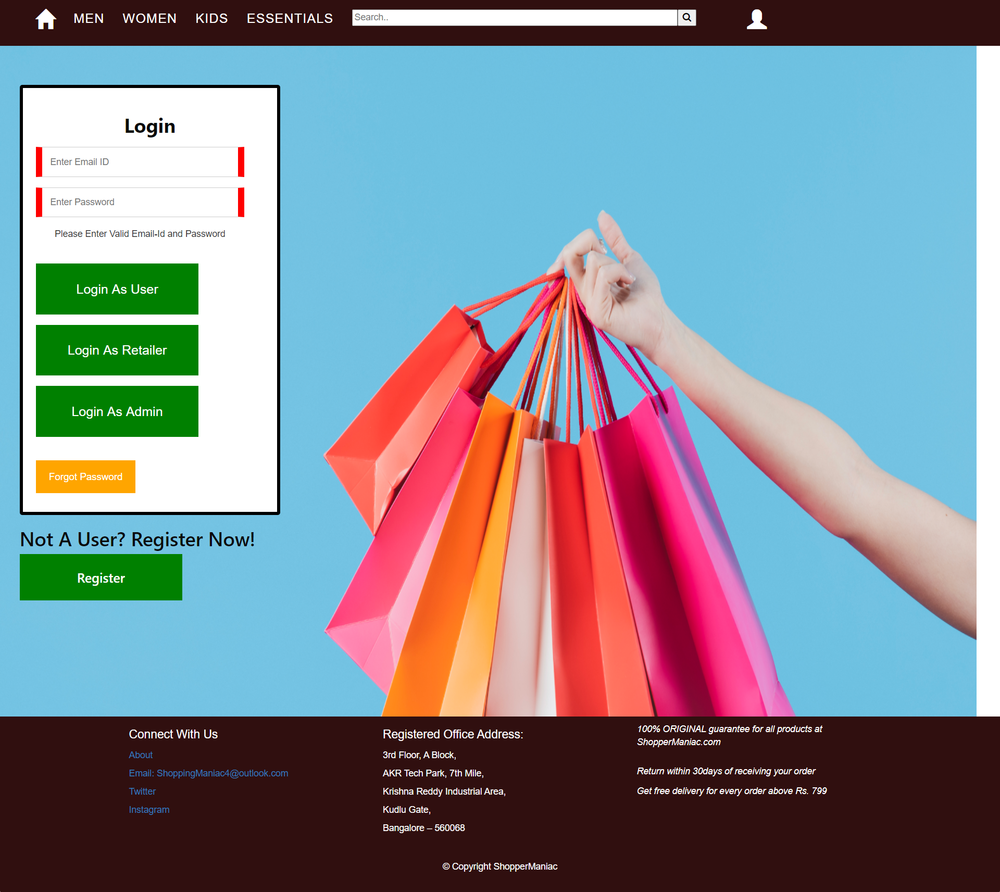
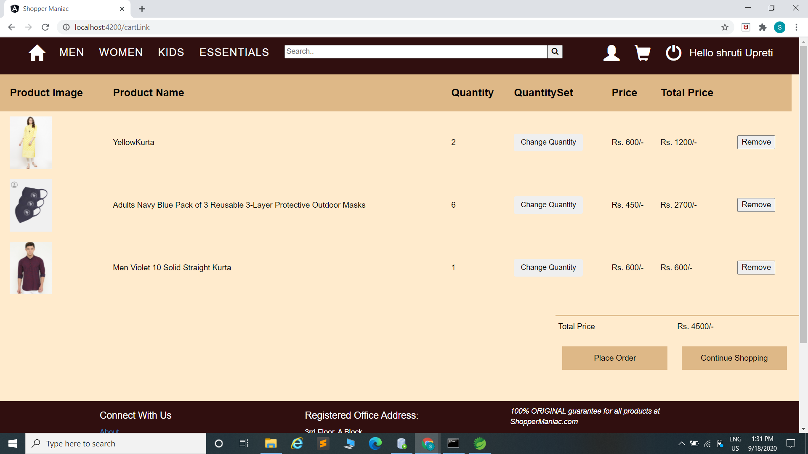

# SHOPPER MANIAC

This is an Online Shopping Website. It will provide platform for several individuals and companies to sell their products. The application is intended to be small and resource efficient. Application will implement all the CRUD operations on database with strict constriction to DRY principle. The goal of our application is to provide a quick and easy to use interface for all users. The system should be available to be used with the least number of variable factors that can affect it.

## Technology
 #### DataBase:
•	Oracle - SQL (Language)
#### Backend:
•	Java 8
•	SpringBoot
•	Hibernate
#### Frontend:
•	HTML
•	CSS
•	Angular
•	TypeScript
**Following are some Feature which are in the website with Snapshot of them**
### Website :
*	New Arrivals will be shown on the front page 
*	Products are divided into 4 categories 
* Men 
*	Women
*	Kids
*	Essential
*	Each category is further divided into sub category.
*	Filters are provided on the bases of :
*	Price 
*	Sub Categories (Different in each on the basis of categories )
*	Search bar: Customer can search for a product by entering a keyword from either of its name or description.
*	Customer can view product from different angles by hovering cursor through them.
*	Customer can see the magnified image of the product if mouse pointer is hovered on the product image.
*	Dashboard / Logout / cart  button will be shown on the header once Customer is logged in 
*	Add to cart (Only after login)

>When not logged in 

>When logged in 

### Customer : 
*	Add to cart (update quantity , calculate price )
*	Place order( mail on ordering)
*	Change Password 
*	Register / Forget Password (register on ordering, Otp in case of forget password)
*	View their orders / cancel them 
*	Login/ Logout 

###	Retailers :
*	Add Products fix their price 
*	Update stock
*	Change Password
* View all the products that he have added

###	Admin : 
*	Admin can view all products and retailers
*	Add retailer, verify legitimacy of updates done by a retailer
*	Verify Products added by the retailer if legitimate than only approve, hence uploaded to the site for customers to buy.
*	Add Retailers (Mail will be send to retailer with their id and password which they can change later on).

*Rest you can explore by running this roject on your system*
